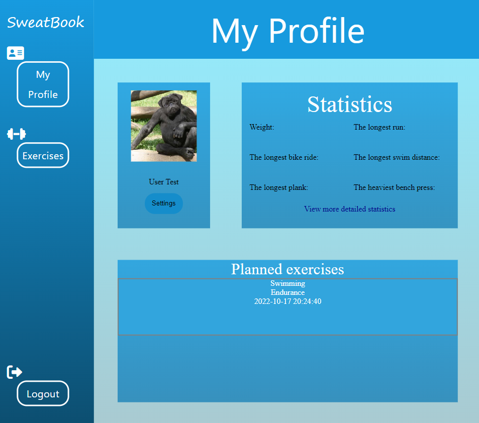
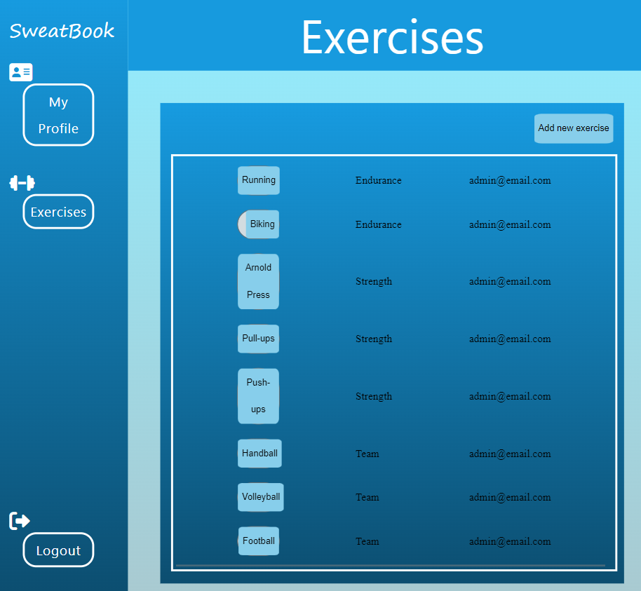

# WDPAI PROJECT

Work in progress

## Table of Contents
* [Description](#Description)
* [Technologies Used](#technologies-used)
* [Features](#features)
* [Screenshots](#screenshots)
* [Setup](#setup)

## Description
Purpose of application is to handle your trainings.

## Technologies Used
* PHP 8.0
* HTML
* CSS
* JavaScript
* PostgreSQL

## Features

- Creating user
- Scheduling exercise
- Creating exercise
- Accepting/Rejecting user exercise

## Screenshots

Login

Profile

Exercise

## Setup
To run project locally you have to install Docker and run

`docker-compose build`

`docker-compose up`

To configure PostgreSQL you have to set your db credentials in env variables:
DB_USERNAME, PASSWORD, HOST, DATABASE
